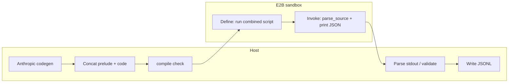

# Agent package design — E2B scrape codegen

This document describes how `sandbox_prelude.py`, `sandbox_scraper.py`, and the host orchestrator (`agent_parser.py`) fit together. 

---

## End-to-end data flow

1. **Anthropic on the host**  
   Given guidelines, the source URL, and a tiered strategy (this is in `agent_parser.py`), the model returns Python only: a function  
   `parse_source(source_url: str, max_items: int) -> list[dict]`  
   that **orchestrates** trusted helpers (named in `GUIDELINES.md`).  
   **No HTTP fetch runs during codegen.** The model does not receive page HTML from the prelude.

2. **Host assembly**  
   The orchestrator concatenates, in order:  
   `sandbox_prelude.py` (full source) + **normalized model output**.  
   The host runs **`compile(..., "exec")`** on the combined script **before** starting E2B (fail fast on `SyntaxError`).

3. **E2B Code Interpreter (one sandbox session)**  
   - **Define cell:** `run_code` executes the **combined** script once.  
     Execution defines prelude functions and `parse_source` in the **same** global namespace (prelude appears **first** in the file; model code follows).  
   - **Invoke cell:** `run_code` runs a small host-built snippet that calls  
     `parse_source(<source_url>, <max_items>)`  
     and **`print(json.dumps(rows))`**.  
   **This** is when the URL is fetched and parsed inside the sandbox.

4. **Host post-process**  
   The orchestrator reads stdout, parses the JSON array, **validates** rows, **normalizes** to the JSONL schema, and appends lines under **`raw/links/<YYYY-MM-DD>.jsonl`**.

---

## Roles of each component

| Piece | Role |
|--------|------|
| **`sandbox_prelude.py`** | Trusted **stdlib-only** helpers (`fetch_url`, feeds, sitemap BFS, etc.). Shipped **verbatim** into the define cell. |
| **Model output** | Thin **orchestration** of those helpers for a specific source pattern. |
| **`sandbox_scraper.py`** | Build define block, host `compile`, create sandbox, two `run_code` steps, parse stdout. |
| **`agent_parser.py`** | Source classification, deterministic adapters vs unknown path, Anthropic calls, repair loop, JSONL writer. |

---

## Token / cost notes

- **Claude:** The **entire** prelude file is **not** inserted into the API prompt. Only **documentation** of the prelude API (e.g. in `GUIDELINES.md`) and strategy text in `agent_parser.py` are sent. Codegen token use grows slightly with that doc size, **not** with the full prelude line count.
- **E2B:** Not billed per LLM token. A larger define cell may use a bit more sandbox time to load/execute; that is separate from Anthropic usage.

---

_Last updated to match the prelude + two-cell E2B design._
